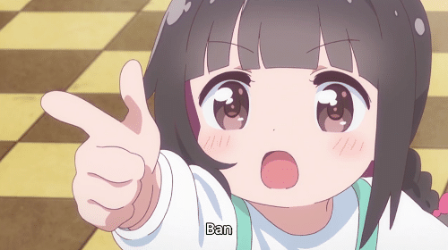

# OutlineBot
## Custom discord bot for GetO2MM.
<hr>

## 1. How to run :

i. Add token to 'env.list' and rename file

ii. Pull from docker hub:
``` bash
docker pull peterzam/outlinebot
```
iii. Docker run
``` bash
docker run -d --env-file ./env.list --name outlinebot peterzam/outlinebot
```
<hr>

## 2. Commands : !req, !request, !vpn, !about

<hr>

### ❗This project does not affiliate with any organization. Just personal fun project.

